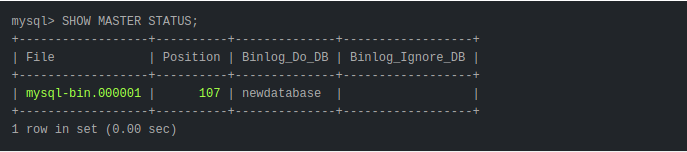
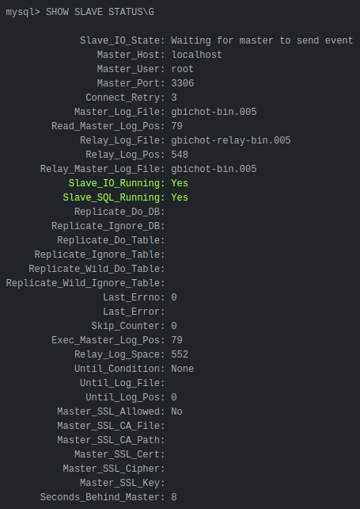

### **Как настроить MySQL Master-Slave репликацию?**
##### Шаг 1. Настройка Master
Сервер (IP - 10.10.0.1) который будет выступать как Master, необходимо внести правки в my.cnf:

Путь до файла my.cnf
* Для ubuntu /etc/mysql/mysql.conf.d/mysqld.cnf
* Для MacOS /usr/local/etc/my.cnf

Выбираем ID сервера: (произвольное число, лучше начинать с 1)   
`server-id = 1`

Путь к бинарному логу:  
`log_bin = /var/log/mysql/mysql-bin.log`

Название Вашей базы данных, которая будет реплицироваться:  
`binlog_do_db = <имя базы данных>`

Настройка формата бинарного файла:
* STATEMENT - пишет в бинлог по сути sql запросы.
* ROW - пишет в бинлог измененные строки.
* MIXED - пишет промежуточный формат, который старается использовать STATEMENT, когда возможно, а когда нет — ROW. 

`binlog_format = ROW`

Определяем размер файла бинлога, который используется при репликации:  
`max_binlog_size = 500M`

После какого кол-во дней автоматически удалять файлы бинлогов:  
`expire_logs_days = 7` 

Определяем логику синхронизации данных из бинлога с диском:
Если значение равно 1, запись на диск будет происходить после каждой транзакции.
Это делает хранилище очень надежным, но крайне сильно нагружает дисковую подсистему на мастере.
Значение 0 отключит синхронизацию из Mysql, 
и база данных будет полагаться на ОС в вопросе записи лога на диск.
Такое значение может увеличить производительность мастера в несколько раз:   
`sync_binlog = 1`

Хранение временный файлов:  
`tmpdir = /tmp`

Сохраняем файл и перезапускаем MySql:  
`sudo service mysql restart`
  
##### Шаг 2. Права на репликацию
Для этого запускаем MySql в консоле Master:  
`mysql -u root -p`

Необходимо создать профиль пользователя, из под которого будет происходить репликация:  
* Для MySql 8:   
`CREATE USER '<ИМЯ_ПОЛЬЗОВАТЕЛЯ>'@'<ИМЯ_ХОСТА>' IDENTIFIED WITH mysql_native_password BY '<ПАРОЛЬ>';`
* Для MySql 5.7:   
`CREATE USER '<ИМЯ_ПОЛЬЗОВАТЕЛЯ>'@'<ИМЯ_ХОСТА>' IDENTIFIED BY '<ПАРОЛЬ>';`

Назначаем права пользователю для репликации:  
`GRANT REPLICATION SLAVE ON *.* TO '<ИМЯ_ПОЛЬЗОВАТЕЛЯ>'@'<ИМЯ_ХОСТА>';`

Обновляем права доступа:  
`FLUSH PRIVILEGES;`

Блокируем все таблицы в нашей базе данных:  
`USE <ИМЯ_БАЗЫ>`  
`FLUSH TABLES WITH READ LOCK;`

Проверяем статус Master сервера:  
`SHOW MASTER STATUS;`

Мы увидим что-то похожее на:  

  
##### Шаг 3. Дамп базы
Необходимо сделать дамп базы данных:  
`mysqldump -u <ИМЯ_ПОЛЬЗОВАТЕЛЯ> -p <ИМЯ_БАЗЫ> > data-dump.sql`

Разблокируем таблицы в консоли mysql:  
`UNLOCK TABLES;`
  
##### Шаг 4. Создание базы на Slave
Для этого запускаем MySql в консоле Slave:  
`mysql -u root -p`

В консоли mysql на Slave создаем базу с таким же именем, как и на Master:  
`CREATE DATABASE <ИМЯ_БАЗЫ> CHARACTER SET utf8 COLLATE utf8_general_ci;`

После этого загружаем дамп:  
`mysql -u <ИМЯ_ПОЛЬЗОВАТЕЛЯ> -p <ИМЯ_БАЗЫ> < data-dump.sql`
  
##### Шаг 5. Настройка Slave
Сервер (IP - 10.10.0.2) который будет выступать как Slave, необходимо внести правки в my.cnf:

Путь до файла my.cnf
* Для ubuntu /etc/mysql/mysql.conf.d/mysqld.cnf
* Для MacOS /usr/local/etc/my.cnf

Выбираем ID сервера: (удобно выбирать следующим числом после Master)   
`server-id = 2`

Путь к relay логу:  
`relay-log = /var/log/mysql/mysql-relay-bin.log`

Путь к bin логу на Master:  
`log_bin = /var/log/mysql/mysql-bin.log`

База данных для репликации:  
`binlog_do_db = <имя базы данных>`

Сохраняем файл и перезапускаем MySql:  
`sudo service mysql restart`
  
##### Шаг 6. Запуск Slave
В консоли mysql на Slave необходимо выполнить запрос:  
`CHANGE MASTER TO 
        MASTER_HOST='<ХОСТ>', 
        MASTER_USER='<ИМЯ_ПОЛЬЗОВАТЕЛЯ>', 
        MASTER_PASSWORD='<ПАРОЛЬ_ПОЛЬЗОВАТЕЛЯ>',
        MASTER_LOG_FILE = '<>', 
        MASTER_LOG_POS = <>;` 
 
**MASTER_LOG_FILE** и **MASTER_LOG_POS** берем из Master командой `SHOW MASTER STATUS;`  

После этого запускаем репликацию на Slave:  
`START SLAVE;`

Проверить работу репликации на Slave можно запросом:  
`SHOW SLAVE STATUS\G`

***
