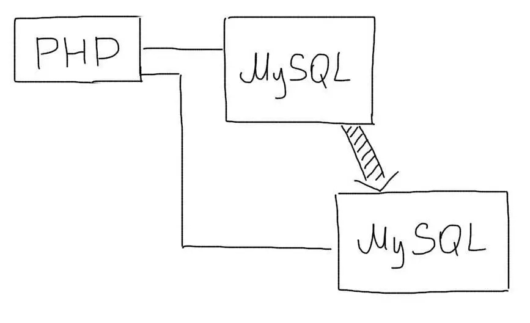
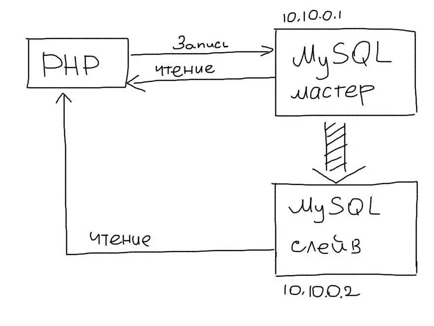
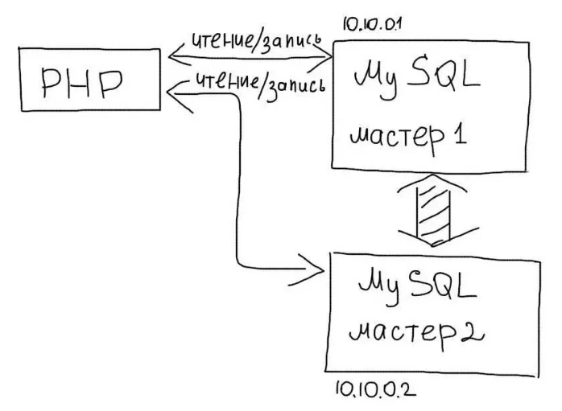

### **Репликация**
Репликация — одна из техник масштабирования баз данных. 
Состоит эта техника в том, что данные с одного сервера базы данных постоянно копируются (реплицируются) на один или несколько других (называемые репликами). 
Для (приложения, сайта) появляется возможность использовать не один сервер для обработки всех запросов, а несколько.
Таким образом появляется возможность распределить нагрузку с одного сервера на несколько.

***

###**Существует два основных подхода при работе с репликацией данных:**
* Репликация Master-Slave;
* Репликация Master-Master.
***

###**Master-Slave репликация**
В этом подходе выделяется один основной сервер базы данных, который называется Мастером.
На нем происходят все изменения в данных (любые запросы MySQL INSERT/UPDATE/DELETE).
Slave сервер постоянно копирует все изменения с Мастера.
С (приложения, сайта) на Slave сервер отправляются запросы чтения данных (запросы SELECT). 
Таким образом Мастер сервер отвечает за изменения данных, а Slave за чтение.

***

###**Master-Master репликация**
В этом подходе любой из серверов может использоваться как для чтения (SELECT) так и для записи (INSERT/UPDATE/DELETE):
Master-Master репликация в MySQL используется распределения нагрузки на базу данных между несколькими серверами.
Хотя Master-Slave репликация намного популярнее и проще, Master-Master репликация может быть полезной.

***
 
 MySql команды репликации:  
`START SLAVE;` - Запустить репликацию  
`STOP SLAVE;` - Оставновить репликацию  
`SHOW SLAVE STATUS\G;` - Показать статус SLAVE сервера  
`SHOW MASTER STATUS;` - Показать статус MASTER сервера 
`RESET SLAVE;` - Сброс настроек репликации  
***
